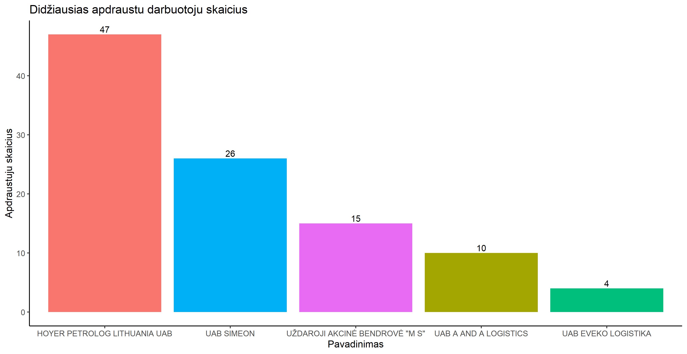

# R Laboratorinis darbas: duomenų vizualizacija

| Variantas | ecoActCode |
|------------- | ------------- |
|6   | 494100 |

### 1. Užduotis

Atsakymas:

Išvados: Vidutinis atlyginimas krovininio kelių transporto sektoriuje 2020 metais buvo lygus 787.4 eur. Iš grafiko galime matyti, kad vidutinis atlyginimas yra labiausiai pasiskirstęs intervale nuo 500 iki 1000 eur.

### 2. Užduotis

Atsakymas:

Išvados:5 įmonės, kurių vidutinis atlyginimas 2020 buvo didžiausias yra šios: "UAB A AND A LOGISTICS", "HOYER PETROLOG LITHUANIA UAB", "UAB SIMEON", "UAB EVEKO LOGISTIKA", "UŽDAROJI AKCINĖ BENDROVĖ \"M S\"". Metų eigoje šiose įmonėse atlyginimas buvo gana pastovus. Dalyje šių įmonių vidutinio atlyginimo reikšmė buvo didžiausia paskutiniais mėnesiais, galimai dėl metų gale išmokėtų premijų.

### 3. Užduotis

Atsakymas:

Išvados: Didžiausią apdraustų darbuotojų skaičių, lygų 47, turi įmonė "HOYER PETROLOG LITHUANIA UAB". Mažiausias apdraustųjų darbuotojų skaičius priklauso įmonei "UAB EVEKO LOGISTIKA": šioje įmonėje yra apdrausti 4 darbuotojai.

### 4. Užduotis

Shiny R aplikacijos nuotrauka:

